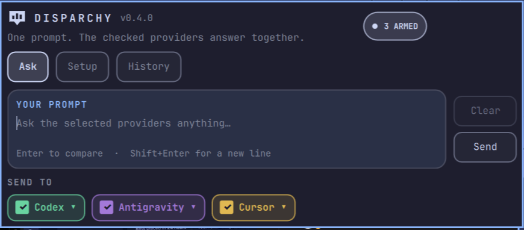
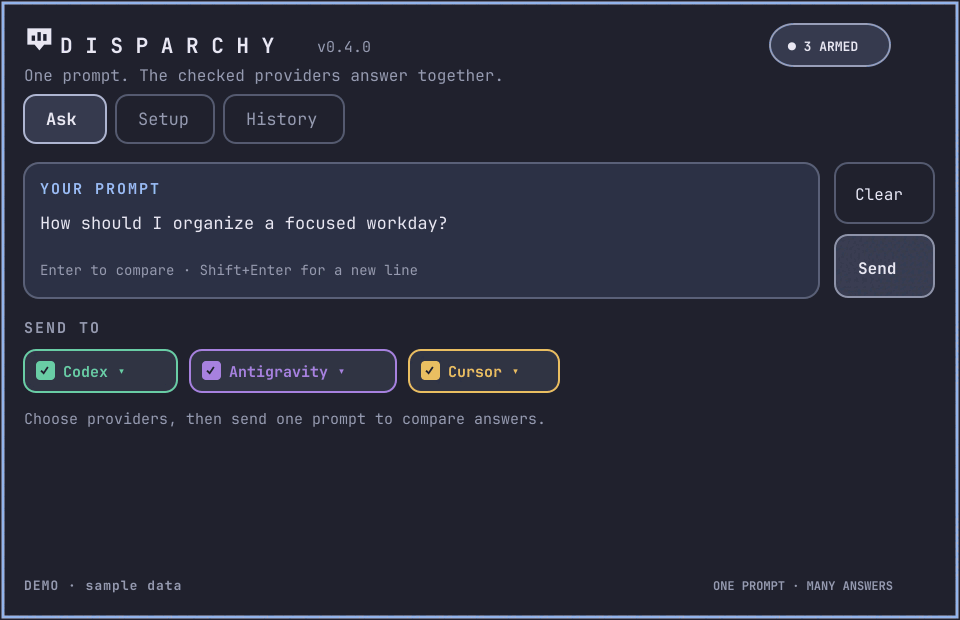
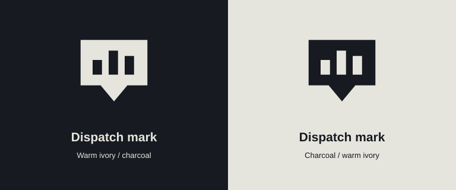

<div align="center">



# Disparchy

**One prompt. The checked providers answer together.**

Write one prompt, choose the providers, and compare their answers side by side. Disparchy brings local AI CLIs and compatible HTTP endpoints into one focused panel.

[](https://omarchy.org)
[](https://quickshell.org)
[](CHANGELOG.md)
[](LICENSE)

Plugin id: `dkfiander.disparchy` · Install: `~/.config/omarchy/plugins/dkfiander.disparchy/`  
Repo: [DonnieFi/Disparchy](https://github.com/DonnieFi/Disparchy) · Architecture: [`docs/architecture.md`](docs/architecture.md)

</div>

---

## See it in motion



This short visual tour uses sample prompts and provider states. The [GIF file](docs/media/disparchy-demo.gif) is ready to share.

---

## The idea

You keep one prompt. Each checked provider runs on its own with its own model, and a failure in one column leaves the others running. The Ask screen gives the prompt room, with Clear above Send and Cancel taking Send’s place while a run is active.

| Provider | Talks to | Default |
|----------|----------|---------|
| **Claude** | `claude` | `sonnet` |
| **Codex** | `codex exec` | CLI default |
| **Grok** | `grok` | CLI default |
| **Antigravity** | `agy` | CLI default |
| **Cursor** | `cursor-agent` | CLI default |
| **OpenClaw** | gateway on port 18789, or the local node. An API key uses `POST /v1/chat/completions` | CLI default, or `openclaw/default` with a key |
| **Hermes** | `hermes chat --oneshot`. An API key uses `POST /v1/chat/completions` | Hermes default, or `hermes-agent` with a key |
| **Ollama** | `http://127.0.0.1:11434` | URL editable in **Setup** |
| **LM Studio** | `http://127.0.0.1:1234` | URL editable in **Setup** |

The first five providers are shown on the bar by default. Change that in **Setup**, where providers sit in two columns with status, endpoint, and enable controls. Auto-paste is a Setup preference and starts off. Model lists come from each CLI when you open the panel. Token counts are estimates based on character count divided by four.

<div align="center">

</div>

The dispatch mark carries the idea in one shape: one prompt opening into three
answer lanes. The bar and panel header use the same mark, recoloured by the
theme. Light and dark SVG/PNG files live in [`assets/dispatch-mark`](assets/dispatch-mark).

History stores past runs locally. Comparison cards render common Markdown, and long answers stay in their own scrollable lanes. The screenshot above shows the blank Ask screen; the image below previews the theme-aware dispatch mark.

---

## Install

Plugins run **unsandboxed** inside your long-lived `omarchy-shell` process. Only add repos you trust. Read the QML and `bin/` before you enable this one ([Omarchy shell plugins](https://omarchy.org)).

```bash
omarchy plugin add https://github.com/DonnieFi/Disparchy.git --enable
omarchy bar move dkfiander.disparchy --section right
```

From a checkout, `./install` copies the files the shell loads into `~/.config/omarchy/plugins/dkfiander.disparchy`. A symlink is replaced. An existing copy is refreshed. Runtime state under `$XDG_STATE_HOME/omarchy/dkfiander.disparchy/` is left alone.

```bash
./install
omarchy-shell shell rescanPlugins
omarchy plugin enable dkfiander.disparchy
```

Validate:

```bash
omarchy plugin validate .
# or
omarchy plugin validate ~/.config/omarchy/plugins/dkfiander.disparchy
```

Open:

```bash
omarchy-shell shell summon dkfiander.disparchy '{}'
```

QML changes need a shell restart. The runner is a new Python process on each send, so `bin/disparchy-run` updates without one.

```bash
omarchy restart shell
```

A locked session refuses that restart.

Optional key. The plugin does not write this for you. Put it in `~/.config/hypr/bindings.lua`. Super+Shift+M is Omarchy's Music key, so Disparchy uses A. If A is already ChatGPT, unbind it first.

```lua
hl.unbind("SUPER + SHIFT + A")
o.bind("SUPER + SHIFT + A", "Disparchy", "omarchy-shell shell toggle dkfiander.disparchy '{}'")
```

---

## Usage

| Action | How |
|--------|-----|
| Open or close | Click the dispatch mark, or Super+Shift+A if you added the bind. Esc closes |
| Ask | Type a prompt. Enter or **Send** compares replies; Shift+Enter adds a line |
| Arm a provider | Check its box. The arrow opens the model list |
| Setup | **Setup** shows or hides providers on the bar. Click the status word to sign in |
| History | **History** lists past runs. **Back** returns to the prompt |
| Auto-paste | **Setup → Auto-paste clipboard** fills an empty prompt when the panel opens. Off by default |
| Clear | **Clear** empties the prompt and hides the current answers. Dim when there is nothing to clear |
| Cancel | **Cancel** shows while a run is in flight. Pending columns become `cancelled` |
| Read an answer | Markdown formatting is shown in each result card. **More** expands a long answer into a scrollable lane; **copy** keeps the original text |

A checkbox arms that provider for the next send. **Setup** decides whether the provider appears on the row at all. HTTP rows stay available when enabled, even if the server is down.

Status words on a **Setup** row:

| Word | Meaning |
|------|---------|
| **install** | CLI is not on `PATH` |
| **sign in** | CLI is installed and the local probe says signed out |
| **open** | CLI is ready. Click to launch it |
| **gateway** | OpenClaw's gateway on `127.0.0.1:18789` answered |
| **local node** | OpenClaw is installed and the gateway is down |
| **reachable** | Ollama or LM Studio answered |
| **endpoint down** | The HTTP URL did not answer |

Sign-in opens a held terminal, `xdg-terminal-exec`, with that CLI's login command. HTTP rows have no login launch.

The header pill reads **Idle**, **N armed**, **N running**, **Setup**, or **N saved**.

The footer reads `in N · out N · ≈ N this run · ≈ N saved`. Each column ends with `≈ N out`.

---

## Configure

Bar-widget settings, also stored in `shell.json` under the widget entry:

| Key | Default | Notes |
|-----|---------|-------|
| `timeoutSec` | `90` | 15–300, per provider |
| `historyMaxRuns` | `50` | 10–200 |
| `modelClaude` | `sonnet` | Used when you have not picked a model |
| `modelCodex` | empty | Empty means the CLI default |
| `modelGrok` | empty | Empty means the CLI default |
| `modelAntigravity` | empty | Empty means the CLI default |
| `modelCursor` | empty | Empty means the CLI default |

Which providers are on the bar, which models you picked, and whether auto-paste is on, live in `selection.json`. That file is not in the widget schema.

Runtime state lives under `$XDG_STATE_HOME/omarchy/dkfiander.disparchy/`. When that variable is unset, the directory is `~/.local/state/omarchy/dkfiander.disparchy/`. The directory is mode `0700`. Files are mode `0600`. Nothing here is written into the plugin tree, because the shell watches that tree and reloads on every write.

| File | Purpose |
|------|---------|
| `selection.json` | Armed models, enabled providers, HTTP URLs, `autoPaste` |
| `auth.json` | API keys for OpenClaw and Hermes. Mode `0600`. Never written into the plugin tree |
| `history.json` | Past runs |
| `prompt.txt` | The prompt file each send reads |
| `status.json` | Last provider probe. Rewritten by the panel |

---

## Remove

```bash
omarchy plugin remove dkfiander.disparchy
```

That disables and removes the installed plugin. Runtime state under `~/.local/state/omarchy/dkfiander.disparchy/` is left alone. Delete that directory if you want a clean slate.

---

## Dependencies

| Need | Required? | Notes |
|------|-----------|-------|
| Omarchy 4 / Quattro + Quickshell | yes | Bar widget host |
| Python 3 | yes | `bin/disparchy-run`, stdlib only |
| `wl-paste` and `wl-copy` | for auto-paste and **copy** | Text clipboard |
| `claude`, `codex`, `grok`, `agy`, `cursor-agent` | optional | Each one you want on the row |
| `openclaw` | optional | Gateway on port 18789, otherwise the local node |
| `hermes` | optional | Must already be the real CLI. A stub installer at that name will run on **Send** |
| Ollama or LM Studio | optional | HTTP. Defaults above |

Missing CLIs show as **install**. They are not send errors.

---

## IPC

Target **`dkfiander.disparchy`**.

```bash
omarchy-shell shell summon dkfiander.disparchy '{}'
omarchy-shell shell hide dkfiander.disparchy
omarchy-shell dkfiander.disparchy open
omarchy-shell dkfiander.disparchy close
omarchy-shell dkfiander.disparchy toggle
omarchy-shell dkfiander.disparchy setup
omarchy-shell dkfiander.disparchy history
```

The panel does not register a second IPC handler. Open, close, show, hide, and toggle are on the bar widget.

---

## How it works

```text
prompt.txt  ──►  disparchy-run --cli … --prompt-file …
                      │
        ┌─────────────┼──────────────┐
        ▼             ▼              ▼
   local CLIs     HTTP POST     OpenClaw
                      │
                      ▼
              one column each
```

Up to six providers run at once. A seventh waits for a free slot. **Cancel** stops the queue. Columns already running finish or time out on their own.

The runner never passes `--force`, `--yolo`, `--always-approve`, or `--dangerously-skip-permissions`. It does not read `~/.grok/auth.json`. An OpenClaw or Hermes API key stays in `auth.json`. The send command receives that path, and the runner puts the key on the `Authorization` header. Codex runs as `codex exec --skip-git-repo-check`, with stdin closed, because `$HOME` is not a trusted git directory.

Command lines, the selection file, and the caps are in [`docs/architecture.md`](docs/architecture.md).

---

## Versions

Version lives in **`manifest.json`** only. Releases bump it, add a [CHANGELOG.md](CHANGELOG.md) entry, and should be tagged `vX.Y.Z`.

---

## Credits

Built for [Omarchy](https://omarchy.org) / Quickshell. The header, status pill, and tabs follow [Lanarchy](https://github.com/DonnieFi/OmarPlugs).

MIT. See [LICENSE](LICENSE).
